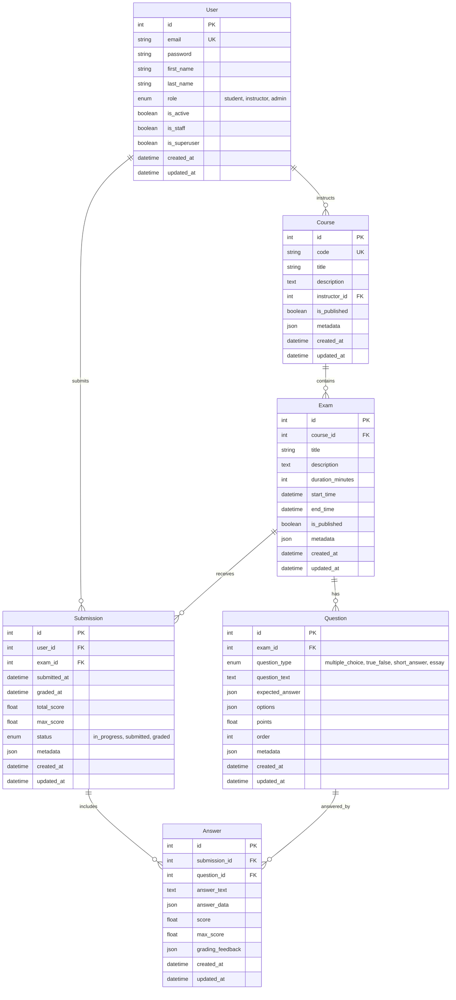
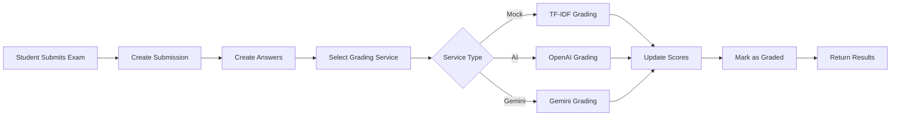

# Entity Relationship Diagram (ERD)

This document contains the database schema for the Mini Assessment Engine.

---

## Database Schema

---

## Key Relationships

### One-to-Many Relationships:

-   **User → Course**: One instructor teaches many courses
-   **User → Submission**: One student makes many submissions
-   **Course → Exam**: One course has many exams
-   **Exam → Question**: One exam has many questions
-   **Exam → Submission**: One exam receives many submissions
-   **Submission → Answer**: One submission has many answers
-   **Question → Answer**: One question has many answers (from different students)

### Constraints:

-   `User.email`: Unique
-   `Course.code`: Unique
-   `(Submission.user_id, Submission.exam_id)`: Unique Together (one submission per user per exam)
-   `(Answer.submission_id, Answer.question_id)`: Unique Together (one answer per question per submission)

### Indexes:

-   Primary keys on all `id` fields
-   Foreign keys on all relationship fields
-   `User.email`, `User.role`
-   `Course.code`, `Course.instructor_id`, `Course.is_published`
-   `Exam.course_id`, `Exam.is_published`, `Exam.start_time`, `Exam.end_time`
-   `Question.exam_id`, `Question.question_type`, `Question.order`
-   `Submission.user_id`, `Submission.exam_id`, `Submission.status`, `Submission.submitted_at`
-   `Answer.submission_id`, `Answer.question_id`

---

## Database Models Summary

| Model          | Description                        | Key Fields                                        |
| -------------- | ---------------------------------- | ------------------------------------------------- |
| **User**       | Authentication and user management | email (unique), role, password                    |
| **Course**     | Academic courses                   | code (unique), instructor, is_published           |
| **Exam**       | Assessments within courses         | course, title, start_time, end_time, is_published |
| **Question**   | Individual exam questions          | exam, question_type, points, expected_answer      |
| **Submission** | Student exam attempts              | user, exam, status, total_score                   |
| **Answer**     | Individual answers in submissions  | submission, question, score, grading_feedback     |

---

## Question Types

The system supports 4 question types:

1. **Multiple Choice** - Single correct answer from multiple options
2. **True/False** - Binary choice questions
3. **Short Answer** - Brief text responses
4. **Essay** - Extended written responses

---

## Grading Flow

---

## Notes

-   **Database**: PostgreSQL (production) or SQLite (development)
-   **ORM**: Django ORM with query optimization (select_related, prefetch_related)
-   **JSON Fields**: Used for flexible data storage (metadata, options, answers)
-   **Timestamps**: All models include created_at and updated_at
-   **Soft Deletes**: Not implemented (hard deletes with CASCADE)
