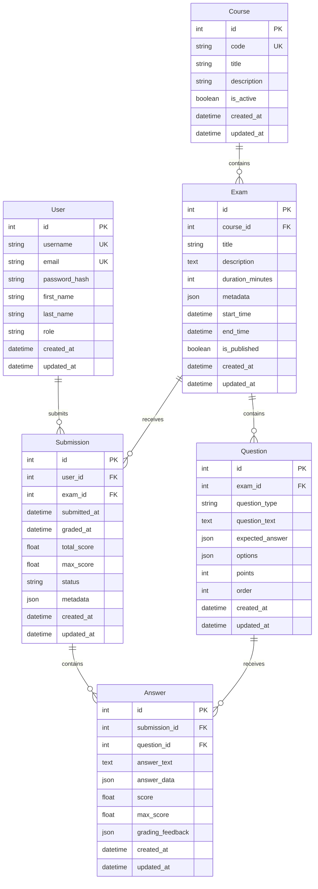

# Acad-AI-Mini-Assessment-Engine

A mini assessment engine simulating core assessment engine of Acad AI

## Database Schema (ERD)

## Key Design Decisions

### Entities

1. **User**: Represents students and potentially instructors

    - Stores authentication credentials (hashed passwords)
    - Role field for future RBAC implementation

2. **Course**: Academic courses that contain exams

    - Unique course code for easy reference
    - Soft delete via `is_active` flag

3. **Exam**: Assessment instances within courses

    - Duration in minutes for time-limited exams
    - Metadata field (JSON) for flexible additional data
    - Start/end times for scheduling
    - Published flag for draft management

4. **Question**: Individual questions within exams

    - Question type (multiple_choice, short_answer, essay, etc.)
    - Expected answer stored as JSON for flexibility
    - Points for weighted scoring
    - Order field for question sequence

5. **Submission**: Student's exam attempt

    - Timestamps for submission and grading
    - Status field (in_progress, submitted, graded)
    - Scores tracked separately (total_score, max_score)

6. **Answer**: Individual answers within a submission
    - Links submission to specific questions
    - Stores both raw answer and grading results
    - Grading feedback for detailed results

### Relationships

-   One-to-Many: Course → Exam, Exam → Question, Exam → Submission, User → Submission
-   One-to-Many: Question → Answer, Submission → Answer

### Indexing Strategy

Primary indexes (will be created automatically):

-   All `id` fields (Primary Keys)
-   `username` and `email` (Unique constraints on User)
-   `code` (Unique constraint on Course)

Recommended secondary indexes:

-   `exam.course_id` - Fast lookup of exams by course
-   `question.exam_id` - Fast retrieval of exam questions
-   `submission.user_id` - Fast lookup of user submissions
-   `submission.exam_id` - Fast lookup of submissions per exam
-   `submission.status` - Filter submissions by status
-   `answer.submission_id` - Fast retrieval of submission answers
-   `answer.question_id` - Analytics on question performance

### Normalization

The schema follows **Third Normal Form (3NF)**:

-   No transitive dependencies
-   All non-key attributes depend only on primary keys
-   Separate entities for each distinct concept
-   Junction handled through proper foreign keys
